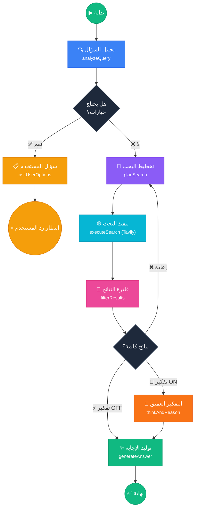
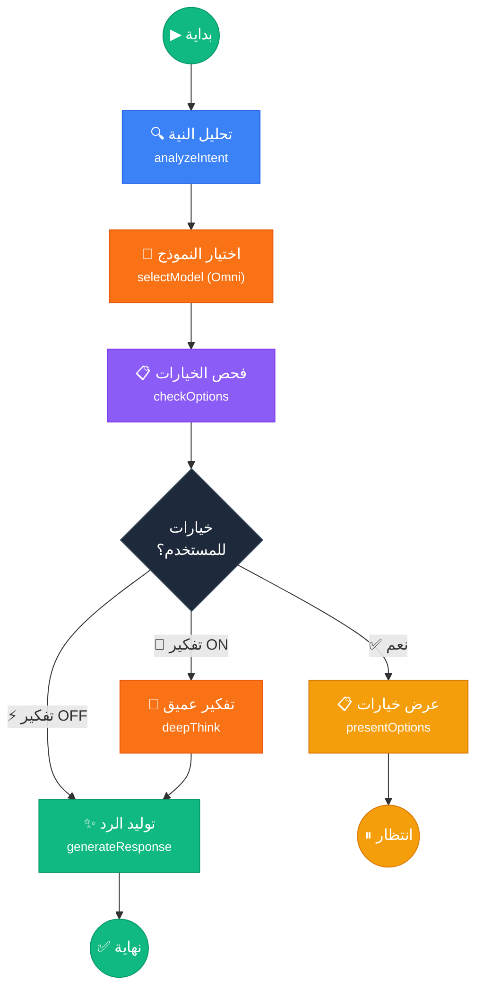
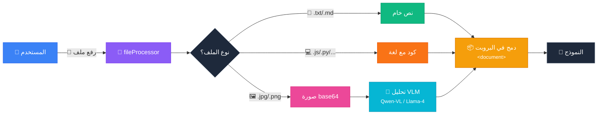
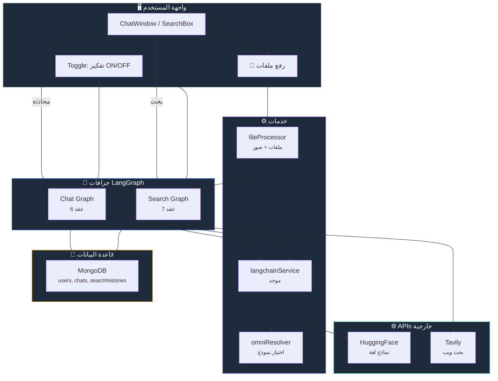
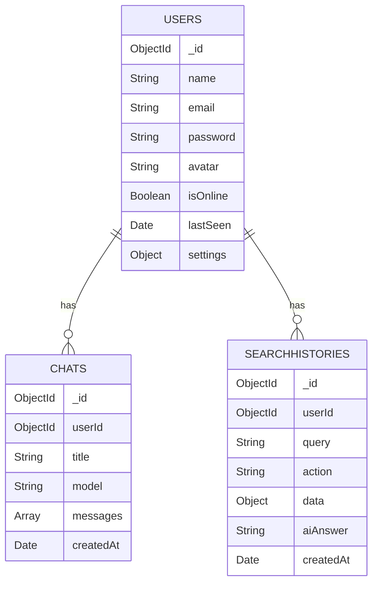

# 🧠 Tavily AI Search & Chat

> منصة بحث ذكية ومحادثة متقدمة مبنية بـ LangGraph + Next.js + MongoDB

---

## 🏗️ هيكلية المشروع

```
src/
├── app/
│   ├── api/
│   │   ├── ai/                    # AI endpoint عام
│   │   ├── analyze-image/         # تحليل الصور عبر VLM
│   │   ├── chat/                  # محادثة ذكية
│   │   ├── process-file/          # معالجة الملفات المرفقة
│   │   ├── smart-search/          # بحث ذكي بـ LangGraph
│   │   ├── tavily/                # بحث مباشر Tavily
│   │   ├── auth/                  # مصادقة (login, signup, google)
│   │   ├── chats/                 # CRUD محادثات
│   │   ├── history/               # سجل البحث
│   │   ├── models/                # قائمة النماذج
│   │   └── settings/              # إعدادات المستخدم
│   ├── page.tsx                   # الصفحة الرئيسية
│   └── layout.tsx                 # التخطيط العام
├── components/
│   ├── ChatWindow.tsx             # واجهة المحادثة
│   ├── SearchBox.tsx              # مربع البحث
│   ├── Sidebar.tsx                # القائمة الجانبية
│   ├── SettingsPanel.tsx          # لوحة الإعدادات
│   ├── MarkdownRender.tsx         # عرض Markdown مع syntax highlighting
│   ├── ThinkingBlock.tsx          # عرض كتل التفكير
│   └── ChatActions.tsx            # اختصارات المحادثة
├── hooks/
│   └── useTypingEffect.ts         # تأثير الكتابة التدريجية
├── lib/
│   ├── searchGraph.ts             # 🧠 جراف البحث الذكي (LangGraph)
│   ├── chatGraph.ts               # 💬 جراف المحادثة الذكي (LangGraph)
│   ├── graphUtils.ts              # أدوات مشتركة للجرافات
│   ├── flowTypes.ts               # أنواع التدفق والحالة
│   ├── langchainService.ts        # خدمة LangChain الموحدة
│   ├── fileProcessor.ts           # معالج الملفات والصور
│   ├── omniResolver.ts            # اختيار النموذج الذكي (Omni)
│   ├── mongodb.ts                 # اتصال MongoDB
│   └── auth.ts                    # مصادقة JWT
├── models/                        # Mongoose models
│   ├── User.ts
│   ├── Chat.ts
│   └── SearchHistory.ts
├── context/
│   ├── AppModeContext.tsx          # سياق الوضع (بحث/محادثة)
│   ├── AuthContext.tsx             # سياق المصادقة
│   └── ThemeContext.tsx            # سياق المظهر
└── types.ts                       # تعريفات الأنواع
```

---

## 🧠 جراف البحث الذكي (Search Graph)



### عقد البحث:

| العقدة | الوظيفة | المدخلات | المخرجات |
|--------|---------|----------|----------|
| `analyzeQuery` | تحليل نية السؤال ونوعه | السؤال الأصلي | intent, keywords, complexity |
| `askUserOptions` | عرض خيارات للمستخدم | التحليل | خيارات قابلة للاختيار |
| `planSearch` | بناء خطة بحث ذكية | التحليل + الخيار | primaryQuery, searchDepth |
| `executeSearch` | تنفيذ البحث عبر Tavily | خطة البحث | نتائج + إجابة أولية |
| `filterResults` | فلترة وترتيب النتائج | النتائج الخام | نتائج مفلترة |
| `thinkAndReason` | تحليل عميق (toggle) | النتائج المفلترة | تفكير واستنتاجات |
| `generateAnswer` | توليد إجابة شاملة | كل ما سبق | إجابة Markdown |

---

## 💬 جراف المحادثة الذكي (Chat Graph)



### عقد المحادثة:

| العقدة | الوظيفة | المدخلات | المخرجات |
|--------|---------|----------|----------|
| `analyzeIntent` | فهم نوع الطلب | الرسالة | type, complexity, needsClarification |
| `selectModel` | اختيار النموذج (Omni) | التحليل | النموذج المناسب |
| `checkOptions` | هل يحتاج خيارات؟ | التحليل | قرار التوجيه |
| `presentOptions` | عرض خيارات | الخيارات | طلب خيار من المستخدم |
| `deepThink` | تفكير خطوة بخطوة | الرسالة + السياق | تفكير منظم |
| `generateResponse` | توليد الرد النهائي | كل ما سبق | رد Markdown |

---

## 📎 معالجة الملفات



### الأنواع المدعومة:

| النوع | الامتدادات |
|-------|-----------|
| 📄 نصي | `.txt` `.md` `.json` `.csv` `.xml` `.yaml` `.yml` `.toml` `.env` `.log` |
| 💻 كود | `.js` `.ts` `.tsx` `.py` `.java` `.cpp` `.c` `.html` `.css` `.sql` `.go` `.rs` `.rb` `.php` `.swift` `.kt` `.vue` `.svelte` |
| 🖼️ صور | `.jpg` `.jpeg` `.png` `.gif` `.webp` `.bmp` |

---

## 🔄 التدفق الكامل (Full Flow)



---

## ⚙️ إعداد المشروع

### المتطلبات
- Node.js 18+
- pnpm
- MongoDB (Atlas أو Local)

### التثبيت
```bash
git clone https://github.com/Msaud7799/tavily-search.git
cd tavily-search
pnpm install
```

### المتغيرات البيئية (.env.local)
```env
HF_TOKEN=hf_xxxxxxxxxxxxx
TAVILY_API_KEY=tvly-xxxxxxxxxxxxx
MONGODB_URI=mongodb+srv://...
JWT_SECRET=your-secret-key
```

### التشغيل
```bash
pnpm dev     # وضع التطوير
pnpm build   # بناء الإنتاج
pnpm start   # تشغيل الإنتاج
```

---

## 🗃️ MongoDB Schema



---

## 🛠️ التقنيات

| التقنية | الاستخدام |
|---------|-----------|
| **Next.js 16** | إطار العمل الأساسي |
| **LangGraph** | بناء جرافات التفكير الذكي |
| **Tavily API** | بحث الويب المتقدم |
| **HuggingFace** | نماذج اللغة (Llama 3.3, Qwen, etc.) |
| **MongoDB** | قاعدة البيانات |
| **Framer Motion** | الرسوم المتحركة |
| **react-syntax-highlighter** | تمييز الكود |
| **TypeScript** | أمان الأنواع |

---

## 📄 الرخصة

MIT License